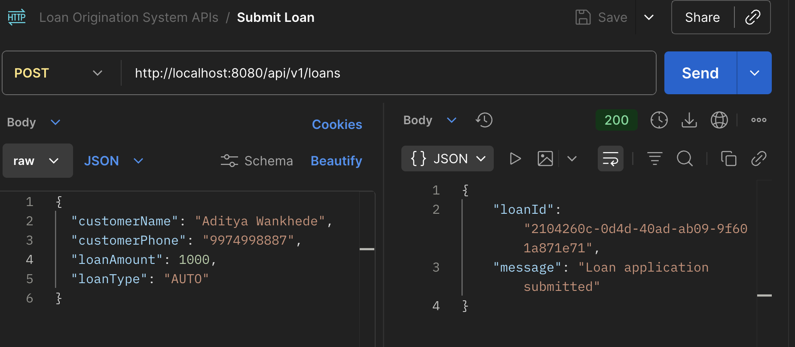
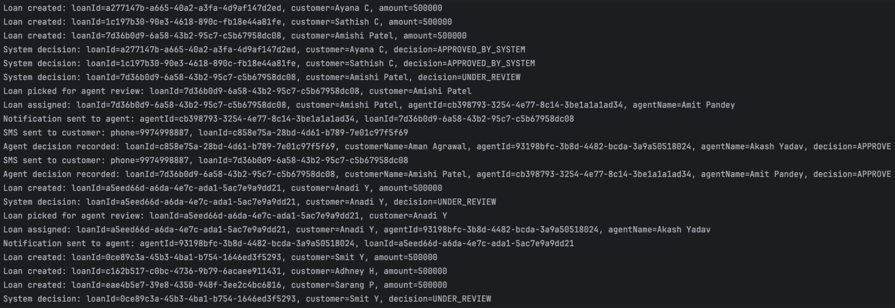
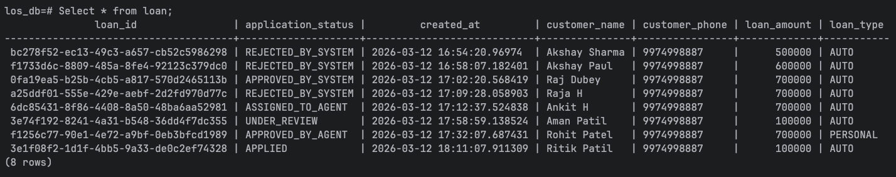

# Loan Origination System (LOS)


A **Java Spring Boot backend system** that simulates an end-to-end **loan origination pipeline**.

The platform processes loan applications using **concurrent background workers**, assigns agents for manual review when necessary, and supports final approval decisions while ensuring **safe parallel execution using database row-level locking**.

---

## **Key Features**

- Concurrent background processing
- Database-level locking for safe parallel processing
- Modular service-based architecture
- REST APIs for loan and agent operations

---

## **Tech Stack**

- **Java 17**
- **Spring Boot**
- **Spring Data JPA**
- **PostgreSQL**
- **Maven**
- **SLF4J Logging**
- **JUnit 5 + Mockito** (Unit Testing)

---

## Architecture Overview

The system follows a **modular service-based architecture** with background workers.

Main components:

- **REST Controllers** handle incoming API requests.
- **Services** contain business logic.
- **Workers** process loans asynchronously.
- **Repositories** interact with the PostgreSQL database.
- **Database row locking** ensures safe concurrent processing.

Workers continuously process loan applications and update statuses using database locking (`FOR UPDATE SKIP LOCKED`) to prevent duplicate processing.

---

## **System Workflow**

The system processes loans through the following lifecycle:

```
Customer submits loan
        ↓
Loan stored with status APPLIED
        ↓
Background worker processes loan
        ↓
System decision:
   APPROVED_BY_SYSTEM
   REJECTED_BY_SYSTEM
   UNDER_REVIEW
        ↓
If UNDER_REVIEW → agent assignment
        ↓
Agent reviews and approves/rejects
```

---

## **Project Structure**

```
LoanOriginationSystem
│
├── src/main/java/LoanOriginationSystem
│
│   ├── controller
│   │   ├── AgentController
│   │   ├── AssignmentController
│   │   ├── CustomerController
│   │   └── LoanController
│
│   ├── dto
│   │   ├── AgentDecisionRequest
│   │   ├── AgentRequest
│   │   ├── LoanAssignmentViewDTO
│   │   ├── LoanRequestDTO
│   │   ├── LoanStatusCountProjection
│   │   └── TopCustomerProjection
│
│   ├── entity
│   │   ├── Agent
│   │   ├── Loan
│   │   └── LoanAssignment
│
│   ├── enums
│   │   ├── AgentStatus
│   │   ├── ApplicationStatus
│   │   └── LoanType
│
│   ├── exception
│   │   ├── AgentNotAuthorizedException
│   │   ├── InvalidDecisionException
│   │   ├── LoanAlreadyDecidedException
│   │   ├── LoanNotAssignedException
│   │   ├── LoanNotFoundException
│   │   └── GlobalExceptionHandler
│
│   ├── repository
│   │   ├── AgentRepository
│   │   ├── LoanRepository
│   │   └── LoanAssignmentRepository
│
│   ├── service
│   │   ├── AgentAssignmentService
│   │   ├── AgentDecisionService
│   │   ├── AgentService
│   │   ├── CustomerQueryService
│   │   ├── LoanMonitoringService
│   │   ├── LoanProcessorService
│   │   ├── LoanRegistrationService
│   │   ├── LoanViewService
│   │   └── notification
│
│   ├── worker
│   │   ├── AgentAssignmentWorker
│   │   └── LoanProcessorWorker
│
│   └── LoanOriginationSystemApplication
│
├── src/main/resources
│   └── application.properties
│
├── src/test/java/LoanOriginationSystem
│   ├── service
│   │   ├── AgentAssignmentServiceTest
│   │   ├── AgentDecisionServiceTest
│   │   ├── AgentServiceTest
│   │   ├── LoanMonitoringServiceTest
│   │   ├── LoanProcessorServiceTest
│   │   └── LoanRegistrationServiceTest
│
│   └── worker
│       ├── AgentAssignmentWorkerTest
│       └── LoanProcessorWorkerTest
│
├── postman
│   ├── loan-origination-system.postman_collection.json
│   └── loan-origination-local.postman_environment.json
│
├── pom.xml
└── README.md
```

---

## **Core Components**

### **LoanRegistrationService**

Handles new loan applications.

Creates a loan with initial status:

```
APPLIED
```

---

### **LoanProcessorWorker + LoanProcessorService**

Background workers process loans automatically.

Each worker repeatedly:

- Fetches loans with status **APPLIED**
- Processes them
- Updates the final status

Possible outcomes:

```
APPROVED_BY_SYSTEM
REJECTED_BY_SYSTEM
UNDER_REVIEW
```

Database locking prevents multiple threads from processing the same loan.

---

### **AgentAssignmentWorker + AgentAssignmentService**

Loans that require manual review are assigned to agents.

Steps:

1. Fetch loans in **UNDER_REVIEW**
2. Find an **AVAILABLE** agent
3. Create a **LoanAssignment**
4. Update statuses

```
loan → ASSIGNED_TO_AGENT
agent → BUSY
```

If no agent is available, the worker retries later.

---

### **AgentDecisionService**

Allows the assigned agent to approve or reject the loan.

Checks performed:

- Loan exists
- Loan is assigned
- Requesting agent is the assigned agent
- Decision is valid
- Loan not already decided

Final statuses:

```
APPROVED_BY_AGENT
REJECTED_BY_AGENT
```

After the decision, the agent becomes **AVAILABLE** again.

---

## **Concurrency Approach**

Multiple worker threads run concurrently.

To prevent duplicate processing, the system uses:

```
FOR UPDATE SKIP LOCKED
```

This ensures:

- Each loan is locked during processing
- Other threads skip locked rows
- No duplicate processing occurs

Transactions ensure atomic updates.

---

## **Database Indexing**

Indexes optimize worker queries.

```sql
CREATE INDEX idx_loan_status_created
ON loan(application_status, created_at);

CREATE INDEX idx_agent_status
ON agent(status);
```

These indexes help:

- Workers fetch loans by status efficiently
- Quickly locate available agents

---

## **REST APIs**

### **Loan APIs**

Submit loan

```
POST /api/v1/loans
```

Get loans by status

```
GET /api/v1/loans?status=UNDER_REVIEW
```

Loan status counts

```
GET /api/v1/loans/status-count
```

---

### **Agent APIs**

Create agent

```
POST /api/v1/agents
```

List agents

```
GET /api/v1/agents
```

Agent decision

```
PUT /api/v1/agents/{agentId}/loans/{loanId}/decision
```

---

### **Monitoring APIs**

Top customers

```
GET /api/v1/customers/top
```

Loan assignments

```
GET /api/v1/assignments
```

---

---

## System Demonstration

The following examples show the system working end-to-end, including API submission, background worker processing, and the resulting database state.

---

### Example API Request

Submitting a loan application using the REST API.



Example request:

```
POST /api/v1/loans
```

Request body:

```json
{
  "customerName": "Aditya Wankhede",
  "customerPhone": "9974998887",
  "loanAmount": 1000,
  "loanType": "AUTO"
}
```

Response:

```json
{
  "loanId": "2104260c-0d4d-40ad-ab09-9f601a871e71",
  "message": "Loan application submitted"
}
```

---

### Example Worker Execution

Background workers automatically process loan applications and move them through the loan lifecycle.



The logs demonstrate the internal workflow:

- Loan creation
- Automatic system decision
- Loans moved to **UNDER_REVIEW**
- Agent assignment
- Agent decision recorded

---

### Example Database State After Processing

Below is the state of the `loan` table after background workers process applications and agent decisions are recorded.



The table demonstrates different lifecycle states of loan applications:

- `APPLIED`
- `APPROVED_BY_SYSTEM`
- `REJECTED_BY_SYSTEM`
- `UNDER_REVIEW`
- `ASSIGNED_TO_AGENT`
- `APPROVED_BY_AGENT`

---

## **Error Handling**

Custom exceptions are used for common scenarios.

| Exception | Scenario |
|----------|----------|
| LoanNotFoundException | Loan ID does not exist |
| LoanNotAssignedException | Loan not assigned to agent |
| AgentNotAuthorizedException | Agent not assigned to the loan |
| LoanAlreadyDecidedException | Decision already recorded |
| InvalidDecisionException | Invalid decision value |

A **global exception handler** converts these into appropriate HTTP responses.

---

## Running the Application

Follow the steps below to run the application locally.

### 1. Install Prerequisites

Ensure the following software is installed on your system:

- **Java 17**
- **Maven**
- **PostgreSQL**

You can verify installations using:

```
java -version
mvn -version
psql --version
```

---

### 2. Start PostgreSQL

Start the PostgreSQL service and open the PostgreSQL CLI.

```
psql -U postgres
```

---

### 3. Create the Database

Create a database for the application.

```sql
CREATE DATABASE los_db;
```

Exit the PostgreSQL CLI after creating the database.

---

### 4. Configure Database Credentials

Open the file:

```
src/main/resources/application.properties
```

Update the database configuration according to your PostgreSQL setup:

```
spring.datasource.url=jdbc:postgresql://localhost:5432/los_db
spring.datasource.username=postgres
spring.datasource.password=postgres

spring.jpa.hibernate.ddl-auto=update
```

---

### 5. Build the Project

Navigate to the project root directory and run:

```
mvn clean install
```

This will compile the project and download all required dependencies.

---

### 6. Run the Application

Start the Spring Boot application using:

```
mvn spring-boot:run
```

---

### 7. Access the Application

Once the application starts successfully, the server will be available at:

```
http://localhost:8080
```

You can now test the APIs using:

- The **Postman collection** included in the repository
- Any REST client such as Postman or curl
  
---

## **Testing**

Unit tests are included for core services and worker components.

Tests use:

- **JUnit 5**
- **Mockito**

Run tests:

```
mvn test
```

---

## **Postman Collection**

A Postman collection is included for testing the APIs.

Location:

```
postman/
```

Steps:

1. Import the collection into Postman
2. Import the environment file
3. Select the environment
4. Run the requests

The collection includes both **successful and failure scenarios**.

---

## **Notes**

If no agents are available when a loan requires manual review, the system logs a warning and retries assignment later.

Once an agent becomes available, the loan can be assigned automatically.

---

## **Author**

**Akshay Charjan**
